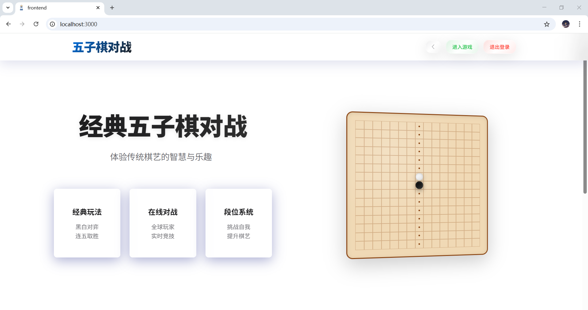
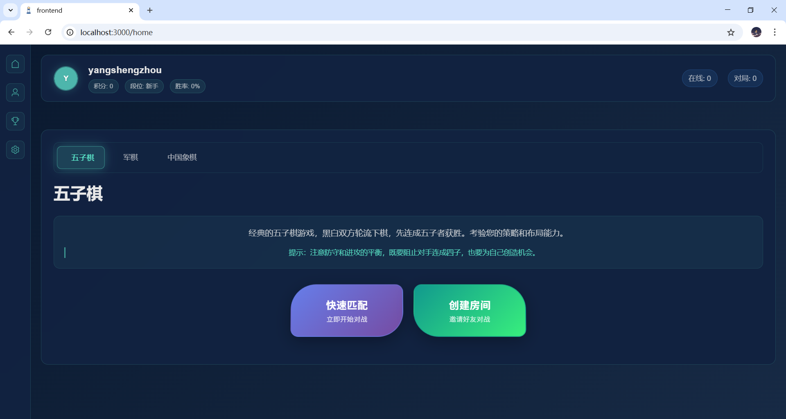

# Come 下棋 - 多棋类在线对战平台

<div align="center">
  <a href="https://gitee.com/phoenix-cities/gobang/blob/master/LICENSE">
    
  </a>
  <a href="https://gitee.com/phoenix-cities/gobang/stargazers">
    
  </a>
  <a href="https://gitee.com/phoenix-cities/gobang/members">
    
  </a>
  <a href="https://vuejs.org/">
    
  </a>
  <a href="https://spring.io/projects/spring-boot">
    
  </a>
  <a href="https://www.mysql.com/">
    
  </a>
  <a href="https://redis.io/">
    
  </a>
  <a href="https://www.docker.com/">
    
  </a>
  <a href="https://nginx.org/">
    
  </a>
</div>

> 一个现代化的多棋类在线对战平台，支持五子棋、军棋、象棋等多种棋类游戏的实时对战。采用前后端分离架构，基于Vue.js和Spring Boot构建，提供流畅的游戏体验和完善的功能体系。

## 功能特性

### 核心功能
- **多种棋类游戏**: 支持五子棋、军棋、象棋等多种棋类
- **实时对战**: 基于WebSocket的低延迟实时通信
- **智能匹配**: 基于ELO积分系统的智能匹配算法
- **用户系统**: 完善的用户注册、登录和个人信息管理
- **积分系统**: 动态积分变化、排行榜和历史记录
- **游戏回放**: 支持完整游戏过程回放和步骤分析
- **好友系统**: 好友添加、在线状态和邀请对战
- **观战模式**: 支持好友观战和公开房间观战

### 技术亮点
- **前后端分离**: Vue.js + Spring Boot全栈解决方案
- **实时通信**: WebSocket协议确保低延迟游戏体验
- **数据安全**: JWT认证、密码加密和HTTPS传输
- **高并发**: Redis缓存、连接池和消息队列优化
- **可扩展性**: 模块化设计，易于添加新棋类和功能
- **容器化部署**: Docker + Docker Compose一键部署
- **自动化测试**: 完整的单元测试和集成测试覆盖

## 项目预览

### 主界面



## 快速开始

### 环境要求
- **Java**: JDK 11+
- **Node.js**: 14.x+
- **MySQL**: 8.0+
- **Redis**: 6.0+
- **Docker**: 20.10+ (可选)

### 使用Docker Compose (推荐)

```bash
# 克隆项目
git clone https://gitee.com/phoenix-cities/gobang.git
cd gobang

# 启动所有服务
docker-compose up -d

# 查看服务状态
docker-compose ps

# 查看日志
docker-compose logs -f
```

访问 http://localhost:3000 开始使用

### 手动安装

#### 1. 克隆项目
```bash
git clone https://gitee.com/phoenix-cities/gobang.git
cd gobang
```

#### 2. 数据库初始化
```bash
# 创建数据库
mysql -u root -p -e "CREATE DATABASE java_gobang CHARACTER SET utf8mb4 COLLATE utf8mb4_unicode_ci;"

# 导入数据库结构
mysql -u root -p java_gobang < database_schema.sql
```

#### 3. 后端配置和启动
```bash
cd backend

# 修改配置文件
cp src/main/resources/application.yml.example src/main/resources/application.yml
# 编辑 application.yml，配置数据库和Redis连接

# 构建项目
mvn clean package -DskipTests

# 启动应用
java -jar target/gobang-backend-*.jar
```

#### 4. 前端配置和启动
```bash
cd frontend

# 安装依赖
npm install

# 配置环境变量
cp .env.example .env
# 编辑 .env，配置API地址

# 启动开发服务器
npm run dev
```

#### 5. 访问应用
- **前端地址**: http://localhost:3000
- **后端API**: http://localhost:8080
- **API文档**: http://localhost:8080/swagger-ui.html

## 技术架构

### 系统架构图


### 前端技术栈
- **框架**: Vue.js 3 + TypeScript
- **UI组件**: Element Plus
- **状态管理**: Pinia
- **路由**: Vue Router 4
- **HTTP客户端**: Axios
- **WebSocket**: 原生WebSocket API
- **构建工具**: Vite
- **代码规范**: ESLint + Prettier

### 后端技术栈
- **框架**: Spring Boot 3.2.x
- **数据库**: MySQL 8.0
- **缓存**: Redis 6.0
- **认证**: Spring Security + JWT
- **数据访问**: MyBatis Plus
- **实时通信**: Spring WebSocket
- **API文档**: Swagger/OpenAPI 3
- **测试**: JUnit 5 + TestContainers
- **消息队列**: RabbitMQ (可选)

### 部署架构
- **容器化**: Docker + Docker Compose
- **负载均衡**: Nginx
- **监控**: Spring Boot Actuator + Micrometer
- **日志**: Logback + ELK Stack (可选)
- **CI/CD**: Gitee Go

## 📁 项目结构

```
gobang/
├── backend/                 # 后端服务
│   ├── src/
│   │   ├── main/
│   │   │   ├── java/        # Java源代码
│   │   │   └── resources/   # 配置文件
│   │   └── test/           # 测试代码
│   ├── pom.xml             # Maven配置
│   └── Dockerfile          # Docker构建文件
├── frontend/               # 前端应用
│   ├── src/
│   │   ├── api/            # API接口
│   │   ├── assets/         # 静态资源
│   │   ├── components/     # 公共组件
│   │   ├── router/         # 路由配置
│   │   ├── store/          # 状态管理
│   │   └── views/          # 页面视图
│   ├── public/             # 公共资源
│   ├── package.json        # NPM配置
│   └── Dockerfile          # Docker构建文件
├── docs/                   # 项目文档
│   ├── api/                # API文档
│   ├── images/             # 文档图片
│   └── deployment/         # 部署文档
├── database_schema.sql     # 数据库结构
├── docker-compose.yml      # Docker Compose配置
└── README.md              # 项目说明
```

## API文档

详细的API文档请参考 [API_DOCUMENTATION.md](docs/api/API_DOCUMENTATION.md)

### 主要接口分类
- **用户管理**: 注册、登录、用户信息管理
- **游戏匹配**: 加入匹配、取消匹配、匹配状态
- **游戏房间**: 创建房间、加入房间、游戏操作
- **积分系统**: 积分查询、排行榜、历史记录
- **好友系统**: 好友添加、删除、在线状态
- **系统配置**: 获取配置、系统状态

### API示例

#### 用户登录
```bash
POST /api/auth/login
Content-Type: application/json

{
  "username": "player1",
  "password": "password123"
}
```

#### 加入游戏匹配
```bash
POST /api/matching/join
Authorization: Bearer {token}
Content-Type: application/json

{
  "gameType": "GOMOKU",
  "ranked": true
}
```

## 测试

### 运行测试

#### 后端测试
```bash
cd backend

# 运行所有测试
mvn test

# 运行特定测试类
mvn test -Dtest=UserServiceTest

# 生成测试覆盖率报告
mvn jacoco:report
```

#### 前端测试
```bash
cd frontend

# 运行单元测试
npm run test

# 运行端到端测试
npm run test:e2e

# 代码质量检查
npm run lint

# 类型检查
npm run type-check
```

### 测试覆盖率
- **后端**: 目标覆盖率 > 80%
- **前端**: 目标覆盖率 > 75%

## 贡献指南

我们欢迎所有形式的贡献！请阅读 [贡献指南](docs/CONTRIBUTING.md) 了解详细信息。

### 开发流程
1. Fork 项目
2. 创建特性分支 (`git checkout -b feature/amazing-feature`)
3. 提交更改 (`git commit -m 'Add some amazing feature'`)
4. 推送到分支 (`git push origin feature/amazing-feature`)
5. 创建 Pull Request

### 代码规范
- 遵循项目代码规范
- 编写单元测试
- 更新相关文档
- 通过所有CI检查

### 问题报告
使用Gitee Issues报告问题，请提供：
- 详细的问题描述
- 复现步骤
- 环境信息
- 相关日志

## 路线图

### v1.0.0 (当前版本)
- [x] 基础五子棋游戏
- [x] 用户系统
- [x] 积分系统
- [x] 基础匹配系统

### v1.1.0 (计划中)
- [x] 军棋游戏
- [x] 好友系统
- [x] 游戏回放
- [ ] 移动端适配

### v1.2.0 (未来)
- [ ] 象棋游戏
- [ ] 观战模式
- [ ] 游戏房间系统
- [ ] 语音聊天

### v2.0.0 (长期)
- [ ] AI对战
- [ ] 锦标赛系统
- [ ] 多语言支持
- [ ] 第三方登录

## 项目状态

<div align="center">
  <a href="https://gitee.com/phoenix-cities/gobang/actions">
    
  </a>
  <a href="https://gitee.com/phoenix-cities/gobang/commits/master">
    
  </a>
  <a href="https://gitee.com/phoenix-cities/gobang/issues">
    
  </a>
</div>

### 最新版本
<div align="center">
  <a href="https://gitee.com/phoenix-cities/gobang/releases">
    
  </a>
</div>

### 活跃贡献者
<div align="center">
  <a href="https://gitee.com/phoenix-cities/gobang/contributors">
    
  </a>
</div>

## 许可证

本项目采用 [MIT许可证](LICENSE) - 查看LICENSE文件了解详情

## 致谢

感谢以下开源项目和贡献者：
- [Vue.js](https://vuejs.org/) - 渐进式JavaScript框架
- [Spring Boot](https://spring.io/projects/spring-boot) - Java应用框架
- [Element Plus](https://element-plus.org/) - Vue 3 UI组件库
- [MyBatis Plus](https://baomidou.com/) - MyBatis增强工具

## 联系我们

- **项目主页**: https://gitee.com/phoenix-cities/gobang
- **问题反馈**: https://gitee.com/phoenix-cities/gobang/issues
- **讨论区**: https://gitee.com/phoenix-cities/gobang/issues/new
- **邮箱**: support@come-xiaqi.com

---

<div align="center">
  <p>如果这个项目对你有帮助，请给我们一个 Star</p>
  <p>Made with love by Come 下棋 Team</p>
</div>